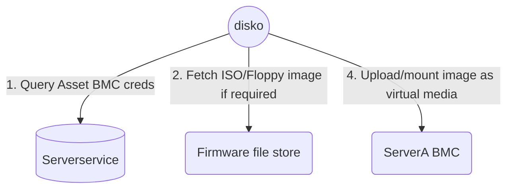

<pre>
      .o8   o8o           oooo
     "888   `"'           `888
 .oooo888  oooo   .oooo.o  888  oooo   .ooooo.
d88' `888  `888  d88(  "8  888 .8P'   d88' `88b
888   888   888  `"Y88b.   888888.    888   888
888   888   888  o.  )88b  888 `88b.  888   888
`Y8bod88P" o888o 8""888P' o888o o888o `Y8bod8P'
</pre>

Mounts virtual media/floppy images on servers through the BMC.

## build

`make build-linux`

## Supported devices

For out of band updates, disko leverages [bmclib.v2](https://github.com/bmc-toolbox/bmclib/tree/v2) and supports firmware installs on all devices that bmclib.v2 supports.
